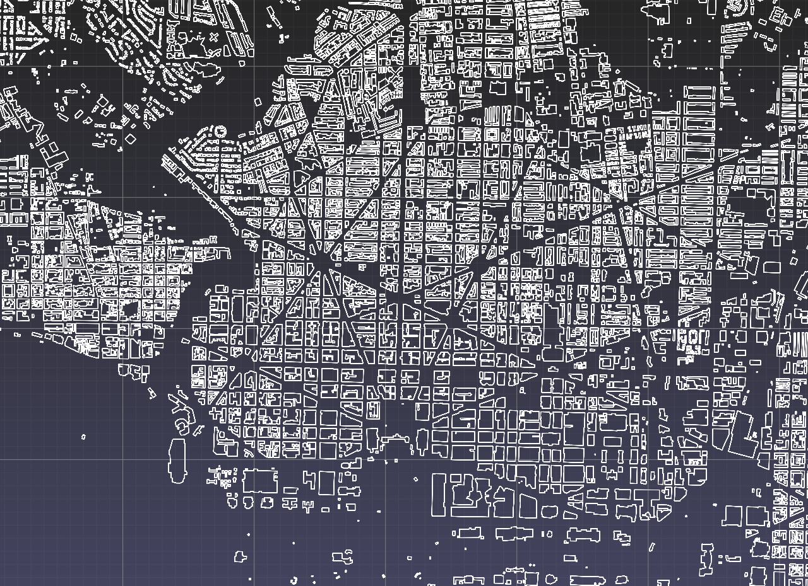
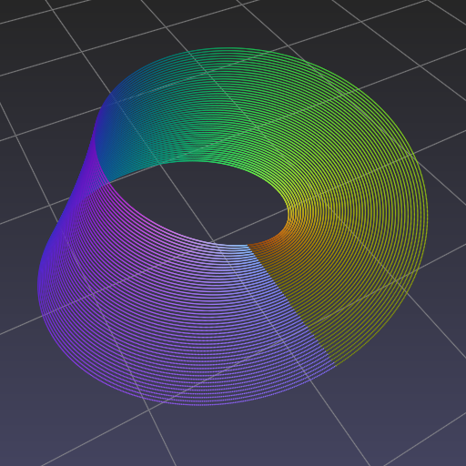

.. title:: Tutorials

Tutorials
=========

Visualizing 2-d and 3-d point data
----------------------------------

.. |semantic3d_small_i| image:: tutorials/viewer/images/semantic3d_small_i.jpg
   :height: 200
   :width: 275
   :scale: 80%
   :align: middle

.. |geolife_utm| image:: tutorials/viewer/images/geolife_utm.png
   :height: 200
   :width: 289
   :scale: 80%
   :align: middle

.. rst-class:: image-grid
.. table::
   :widths: 280 294 280 205
   :align: center

   ==================== ============= =============== ========
   |semantic3d_small_i| |geolife_utm| |footprints_dc| |mobius|
   ==================== ============= =============== ========

.. rst-class:: caption

   +---------------------------------------------------------------------------------------------------------------+
   | Point datasets visualized using :py:meth:`pptk.viewer`.                                                       |
   | The :file:`bildstein1` Lidar point cloud from `Semantic3D <http://semantic3d.net>`__ (left).                  |
   | Beijing GPS trajectories from                                                                                 |
   | `Geolife <https://www.microsoft.com/en-us/research/publication/geolife-gps-trajectory-dataset-user-guide/>`__ |
   | (middle left).                                                                                                |
   | :file:`DistrictofColumbia.geojson` 2-d polygons from                                                          |
   | `US building footprints <https://github.com/Microsoft/USBuildingFootprints>`__ (middle right).                |
   | A Mobius strip (right).                                                                                       |
   +---------------------------------------------------------------------------------------------------------------+

:py:func:`pptk.viewer` allows interactive visualization of any point data that can be represented as a 3-column numpy array.
This includes Lidar point clouds, GPS trajectories, points on a 3-d parametric surface, or even point samplings of 2-d polygons.
The viewer is not tied to a specific file format.
As shown in these tutorials,
users of pptk may leverage the vast collection of existing Python packages for reading data from specific file formats.
For example, the pandas package is very well-suited for reading .csv files,
and the plyfile package for reading .ply files.
The following tutorials each consider a different point dataset
and provide step-by-step instructions for visualizing them using :py:func:`pptk.viewer`.

**Lidar point clouds**

.. toctree::
   :maxdepth: 1
   
   Semantic3D dataset <tutorials/viewer/semantic3d>
   Tanks and Temples dataset <tutorials/viewer/tanks_and_temples>

**GPS trajectories**

.. toctree::
   :maxdepth: 1

   Geolife dataset <tutorials/viewer/geolife>

**2-d Polygons**

.. toctree::
   :maxdepth: 1
   
   U.S. building footprints dataset <tutorials/viewer/building_footprints>

**Parametric surfaces**

.. toctree::
   :maxdepth: 1
   
   Hyperbolic paraboloid <tutorials/viewer/saddle>
   Mobius strip <tutorials/viewer/mobius>
