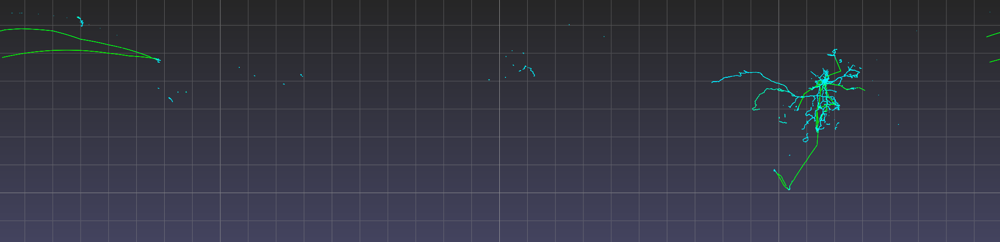
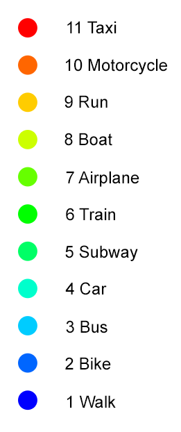

.. title:: Visualizing the Geolife dataset

Geolife dataset
===============

Download the dataset from the
`Geolife <https://www.microsoft.com/en-us/research/publication/geolife-gps-trajectory-dataset-user-guide/>`_ project website

Extract the zip file and observe the following directory structure.

.. code-block:: none
   :caption: Geolife dataset folder structure

    Data/
    |
    +-- 000/
    +-- 001/
    ...
    +-- 010/
    |    +-- labels.txt
    |    +-- Trajectory/
    |        +-- 20070804033032.plt
    |        +-- 20070804155303.plt
    |        ...
    ...
    +-- 181/

The top level :code:`Data/` folder contains 182 user folders, numbered :code:`000/` to :code:`181/`.
Each user folder has a :code:`Trajectory/` folder containing the user's GPS trajectories (saved as .plt files)
and optionally a :code:`labels.txt` file specifying the mode of transportation employed for a given time interval.

The .plt files look like this.
Starting with the seventh line, each line specifies in a comma-separated fashion the attributes of a single GPS point:
(0) latitude, (1) longitude, (2) unused, (3) altitude, (4) days since Dec. 30 1899, (5) date, (6) time.

.. code-block:: none
   :caption: Data/010/Trajectory/20070804033032.plt

    Geolife trajectory
    WGS 84
    Altitude is in Feet
    Reserved 3
    0,2,255,My Track,0,0,2,8421376
    0
    39.921712,116.472343,0,13,39298.1462037037,2007-08-04,03:30:32
    39.921705,116.472343,0,13,39298.1462152778,2007-08-04,03:30:33
    39.921695,116.472345,0,13,39298.1462268519,2007-08-04,03:30:34
    ...

The :code:`labels.txt` files look like this.
Each line specifies in a space-delimited fashion the start date, start time, end date, end time, and mode of transportation.

.. code-block:: none
   :caption: Data/010/labels.txt

    2008/11/01 03:59:27 2008/11/01 04:30:18 train
    2008/11/01 04:35:38 2008/11/01 05:06:30 taxi
    2008/11/04 10:18:55 2008/11/04 10:21:11 subway
    2008/11/04 11:02:34 2008/11/04 11:10:08 taxi
    2008/11/04 11:14:08 2008/11/04 11:22:48 walk
    2008/11/04 14:38:07 2008/11/04 14:40:15 subway
    2008/11/04 14:41:44 2008/11/04 14:43:39 walk
    ...

Loading the dataset
-------------------

Both .plt and :code:`labels.txt` files are readily parsed using :py:func:`pandas.read_csv`,
which also has builtin date/time parsing capabilities.
The following code defines Python functions that use :py:func:`pandas.read_csv` to load the Geolife dataset into Python.

Copy the following code into a file named read_geolife.py.

.. code-block:: python
   :linenos:
   :caption: read_geolife.py

   import numpy as np
   import pandas as pd
   import glob
   import os.path
   import datetime
   import os
   
   def read_plt(plt_file):
       points = pd.read_csv(plt_file, skiprows=6, header=None,
                            parse_dates=[[5, 6]], infer_datetime_format=True)
   
       # for clarity rename columns
       points.rename(inplace=True, columns={'5_6': 'time', 0: 'lat', 1: 'lon', 3: 'alt'})
   
       # remove unused columns
       points.drop(inplace=True, columns=[2, 4])
   
       return points
   
   mode_names = ['walk', 'bike', 'bus', 'car', 'subway','train', 'airplane', 'boat', 'run', 'motorcycle', 'taxi']
   mode_ids = {s : i + 1 for i, s in enumerate(mode_names)}
   
   def read_labels(labels_file):
       labels = pd.read_csv(labels_file, skiprows=1, header=None,
                            parse_dates=[[0, 1], [2, 3]],
                            infer_datetime_format=True, delim_whitespace=True)
   
       # for clarity rename columns
       labels.columns = ['start_time', 'end_time', 'label']
   
       # replace 'label' column with integer encoding
       labels['label'] = [mode_ids[i] for i in labels['label']]
   
       return labels

   def apply_labels(points, labels):
       indices = labels['start_time'].searchsorted(points['time'], side='right') - 1
       no_label = (indices < 0) | (points['time'].values >= labels['end_time'].iloc[indices].values)
       points['label'] = labels['label'].iloc[indices].values
       points['label'][no_label] = 0
   
   def read_user(user_folder):
       labels = None
   
       plt_files = glob.glob(os.path.join(user_folder, 'Trajectory', '*.plt'))
       df = pd.concat([read_plt(f) for f in plt_files])
   
       labels_file = os.path.join(user_folder, 'labels.txt')
       if os.path.exists(labels_file):
           labels = read_labels(labels_file)                
           apply_labels(df, labels)
       else:
           df['label'] = 0
   
       return df
   
   def read_all_users(folder):
       subfolders = os.listdir(folder)
       dfs = []
       for i, sf in enumerate(subfolders):
           print('[%d/%d] processing user %s' % (i + 1, len(subfolders), sf))
           df = read_user(os.path.join(folder,sf))
           df['user'] = int(sf)
           dfs.append(df)
       return pd.concat(dfs)

Understanding of the following explanation of :file:`read_geolife.py` is not necessary for proceding with the tutorial.
Feel free to skip ahead if you are in a hurry.

- *Lines 1-6* imports required Python packages (use :code:`pip install` for retrieving any missing packages).

- *Lines 8-18* implements function :py:func:`read_plt` for reading .plt files into a pandas dataframe.
  It uses the :py:func:`pandas.read_csv` function with the keyword argument :code:`parse_dates=[[5, 6]]`
  to indicate that columns 5 and 6 should be interpretted together as a single timestamp.
  By default timestamps are represented as 64-bit integers recording the number of nanoseconds since 1970-01-01T00:00Z.

- *Lines 20-21* defines an integer encoding for the modes of transportation that appear in :code:`labels.txt` files
  (i.e. :code:`mode_ids['walk']` evaluates to 1).
  This is so that points can later be colored by per-point integer labels.
  The label 0 is reserved for denoting the lack of a label, as the dataset contains a large number of unlabelled points.

- *Lines 23-34* implements function :py:func:`read_labels` for reading :code:`labels.txt` files into a pandas dataframe,
  again using :py:func:`pandas.read_csv`
  (this time attributes are whitespace-delimited, hence the keyword argument :code:`delim_whitespace=True`).

- *Lines 36-40* implements function :py:func:`apply_labels`,
  which assigns a label to each point (i.e. row) in :code:`points`,
  by determining the time interval that the point resides in and assigning the label of that time interval to the point.
  Points that do not reside in any time interval in :code:`labels` are assigned the label 0.

- *Lines 42-55* implements function :py:func:`read_user` for reading all points from a single user
  and applying labels if a :code:`labels.txt` is present.

- *Lines 57-65* implements function :py:func:`read_all_users` for reading all points from all users.

Ensure pandas and numpy are installed on your system; if not, use :code:`pip install` to install.

In a new Python terminal, use the :py:func:`read_all_users` function to load the dataset.
On a test machine this takes about 10 minutes.

.. code-block:: python

    >>> import read_geolife
    >>> df = read_geolife.read_all_users('Data')
    >>> df
                      time        lat         lon          alt  label  user
    0  2008-10-23 02:53:04  39.984702  116.318417   492.000000      0     0
    1  2008-10-23 02:53:10  39.984683  116.318450   492.000000      0     0
    2  2008-10-23 02:53:15  39.984686  116.318417   492.000000      0     0
    ..        ...      ...        ...         ...          ...    ...   ...
    21 2008-03-14 03:43:40  40.910933  111.711617  3802.493438      0   181
    
    [24876978 rows x 6 columns]

(Optional)
Consider saving the dataframe to a file format (e.g. .pkl or .hdf) that supports faster loading in the future.

.. code-block:: python

   >>> df.to_pickle('geolife.pkl')  # saves df to 'geolife.pkl'
   >>> import pandas as pd
   >>> df = pd.read_pickle('geolife.pkl')  # reads 'geolife.pkl' into df

Visualize using latitude-longitude coordinates
----------------------------------------------

Construct a point cloud using longitude as the x-coordinate and latitude as the y-coordinate.
Directly using altitude as the z-coordinate will cause the points to appear as a very thin column of points.
This is due to differences in units (i.e. degrees vs. meters).
We thus choose here to set the z-coordinate to 0 and to convey altitude via a per-point color.

.. code-block:: python

    >>> import numpy as np
    >>> P = np.c_[df['lon'], df['lat'], np.zeros(len(df))]

Visualize and color each point based on its altitude.

.. code-block:: python

    >>> import pptk
    >>> v = pptk.viewer(P)
    >>> v.attributes(df['alt'])

.. rst-class:: caption

   +-----------------------------------------------------------------------------+
   | Full view of `Geolife`_ dataset in lat-lon with points colored by altitude. |
   +-----------------------------------------------------------------------------+

Since we are interested only in the spatial arrangements of points on the x-y plane,
Press :kbd:`5` to toggle to an orthographic view, and press :kbd:`7` to go to a top-down view.
Pan the viewpoint by pressing the :kbd:`LMB` while holding the :kbd:`Shift` key.
Double click with the :kbd:`LMB` on a point to recenter the view on that point.
And use the mouse wheel to zoom in/out.
To inspect the attribute of a point, which here is altitude,
left click the point while holding the :kbd:`Ctrl` key.
Deselect by right clicking anywhere.
See the :doc:`viewer page <../../viewer>` for the full instructions on using the viewer.

.. note::
   On Mac, use :kbd:`⌘` instead of :kbd:`Ctrl`

The mapping from per-point attribute value to per-point color is determined automatically based on the range of attribute values.
But the presence of bad attribute values (e.g. unreasonably large or small altitude values) may result in a poor color mapping,
where the majority of the points get assigned a small range of colors.

.. code-block:: python

    >>> np.min(df['alt'])
        -32647.6
    >>> np.max(df['alt'])
        107503.3

Improve the color map by manually setting the mapping domain using :py:meth:`viewer.color_map <pptk.viewer.color_map>`.

.. code-block:: python

    >>> v.color_map('jet', scale=[0, 20000])

.. image:: images/geolife_latlon_labeled.png
   :align: center
   :width: 900px

.. rst-class:: caption

   +----------------------------------------------------------------------------------------------------+
   | Full view of `Geolife`_ dataset in lat-lon with an improved color map                              |
   | (i.e. the greater range of colors allows one to better see the changes in altitude across points). |
   +----------------------------------------------------------------------------------------------------+

Observe that point coverage is world wide,
as there are points not just in Beijing but also in faraway cities such as Rome and Seattle.
Observe also the high altitude points (i.e. airplane trajectories) that connect some of these cities.
A future release of the pptk viewer may include support for overlaying points on map tiles
(e.g. `HERE Map Tile <https://developer.here.com/documentation/map-tile/topics/introduction.html>`__)
for better supporting such visualizations.

.. note::
   You may notice that you cannot zoom in as close as you would like.
   This is because there is currently a hardcoded limit on zooming in,
   which a future release of pptk will fix.
   This is not an issue when viewing data such as Lidar point clouds that are typically specified in meters,
   but becomes a limitation when viewing lat-lon points
   (i.e. two points 1m apart translates to a very small difference in lat/lon).
   Meanwhile, to zoom in further, consider scaling up the lat-lon values,
   or converting the points to UTM coordinates, as described in the next section.

Visualize using UTM coordinates
-------------------------------

Directly mapping lon-lat to x-y (i.e. x <- lon, y <- lat),
as in the previous section,
causes points to appear stretched apart near the north and south poles.
Alternatively, the `UTM projection <https://en.wikipedia.org/wiki/Universal_Transverse_Mercator_coordinate_system>`__
is able to convert lat-lon coordinates into units of meters
while only introducing a relatively small amount of stretching/shrinking between points in the same UTM zone.
In this section, we show how to apply the UTM projection on GPS points in UTM zone 50 (Beijing's UTM zone),
which we then visualize using :py:meth:`pptk.viewer`.

First remove points that are outside the UTM zone 50.
This is to remove any invalid points that may later convert to unreasonably large UTM coordinates
(the dataset contains a point with invalid latitude of 400.17)

.. code-block:: python

    >>> mask_50 = (df['lon'] > 114.0) & (df['lon'] < 120.0) & (df['lat'] > 32.0) & (df['lat'] < 48.0)
    >>> df_50 = df[mask_50]

Use pyproj to convert latitudes and longitudes into meters in the UTM coordinate system.

.. code-block:: python

    >>> import pyproj
    >>> proj = pyproj.Proj(proj='utm', zone=50, ellps='WGS84')
    >>> x, y = proj(df_50['lon'].tolist(), df_50['lat'].tolist())
    >>> p = np.c_[x, y, 0.3048 * df_50['alt']]  # alt originally in feet

Visualize the points.

.. code-block:: python

    >>> v = pptk.viewer(p)

Visualize points colored by transportation mode (non-labelled points removed).
Optionally, one may use :py:meth:`viewer.color_map <pptk.viewer.color_map>` to manually set the color of each label.

    >>> mask_labelled = df_50['label'] != 0
    >>> v = pptk.viewer(p[mask_labelled])
    >>> v.attributes(df_50[mask_labelled]['label'])

Again :kbd:`Ctrl` + left click on a point to examine its mode of transportation attribute.

.. |geolife_utm| image:: images/geolife_utm.png
   :width: 390px
   :align: middle

.. |geolife_utm_zoomed| image:: images/geolife_utm_zoomed.png
   :width: 390px
   :align: middle

.. rst-class:: image-grid
.. table::
   :widths: 400 400 120
   :align: center
   
   ============= ==================== ================
   |geolife_utm| |geolife_utm_zoomed| |geolife_legend|
   ============= ==================== ================

.. rst-class:: caption

   +------------------------------------------------------------------------------------+
   | `Geolife`_ GPS points in UTM coordinates visualized using :py:meth:`pptk.viewer`.  |
   | Points are from around the Beijing area and are colored by mode of transportation. |
   +------------------------------------------------------------------------------------+
