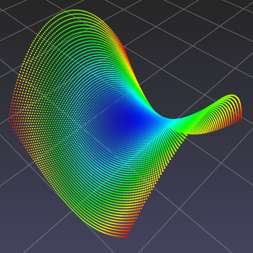
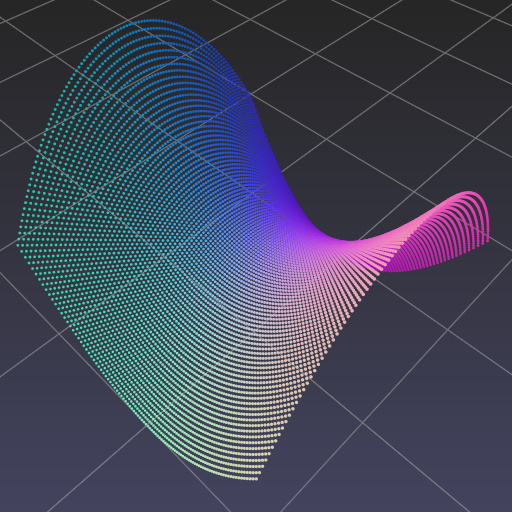

.. title:: Visualizing a hyperbolic paraboloid

Hyperbolic paraboloid
=====================

Given `hyperbolic paraboloid <https://en.wikipedia.org/wiki/Paraboloid>`_

.. math::
   f(x,y) = x^2-y^2

define corresponding Python function :py:func:`f`

.. code-block:: python

    >>> def f(x, y):
            return x ** 2 - y ** 2

Evaluate :py:func:`f` on 100 x 100 uniformly spaced samples in [-1, 1] x [-1, 1].

.. code-block:: python

    >>> import numpy as np
    >>> t = np.linspace(-1.0, 1.0, 100)
    >>> x, y = np.meshgrid(t, t)
    >>> z = f(x, y)

Concatenate x, y and z into a single array of points.

.. code-block:: python

    >>> P = np.stack([x, y, z], axis=-1).reshape(-1, 3)

Visualize.

.. code-block:: python

    >>> import pptk
    >>> v = pptk.viewer(P)
    >>> v.attributes(P[:, 2])  # color points by their z-coordinates
    >>> v.set(point_size=0.005)

One can also calculate and visualize additional per-point attributes.

.. code-block:: python

    >>> # calculate gradients
    >>> dPdx = np.stack([np.gradient(x, axis=1), np.gradient(y, axis=1), np.gradient(z, axis=1)], axis=-1)
    >>> dPdy = np.stack([np.gradient(x, axis=0), np.gradient(y, axis=0), np.gradient(z, axis=0)], axis=-1)
    
    >>> # calculate gradient magnitudes
    >>> mag = np.sqrt(np.sum(dPdx ** 2 + dPdy ** 2, axis=-1)).flatten()
    
    >>> # calculate normal vectors
    >>> N = np.cross(dPdx, dPdy, axis=-1)
    >>> N /= np.sqrt(np.sum(N ** 2, axis=-1))[:, :, None]
    >>> N = N.reshape(-1, 3)
    
    >>> # set per-point attributes
    >>> v.attributes(P[:, 2], mag, 0.5 * (N + 1))

Toggle between attributes using the :kbd:`[` and :kbd:`]` keys.

.. |saddle_z| image:: images/saddle_z.png
   :width: 256px
   :align: middle

.. rst-class:: image-grid
.. table::
   :widths: 275 275 275
   :align: center

   ========== ============ ==========
   |saddle_z| |saddle_mag| |saddle_n|
   ========== ============ ==========

.. rst-class:: caption

   +------------------------------------------------------------------------------------------------------+
   | Visualization of :math:`f(x,y)=x^2-y^2`.                                                             |
   | Points are colored by :math:`f` (left), :math:`|\nabla f|` (middle), and normal directions (right)   |
   +------------------------------------------------------------------------------------------------------+
