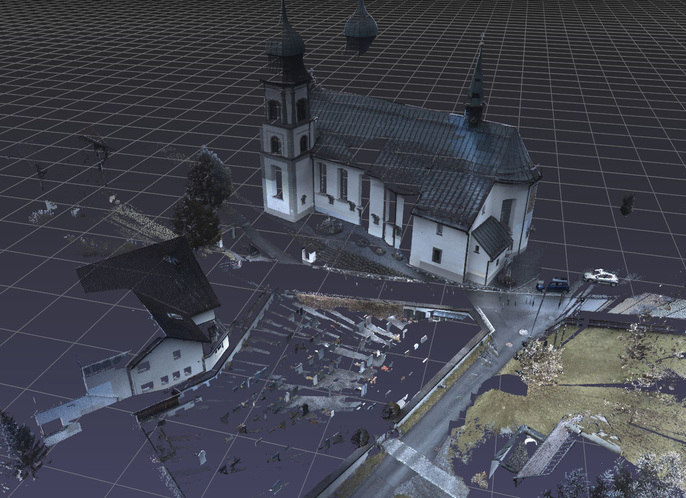
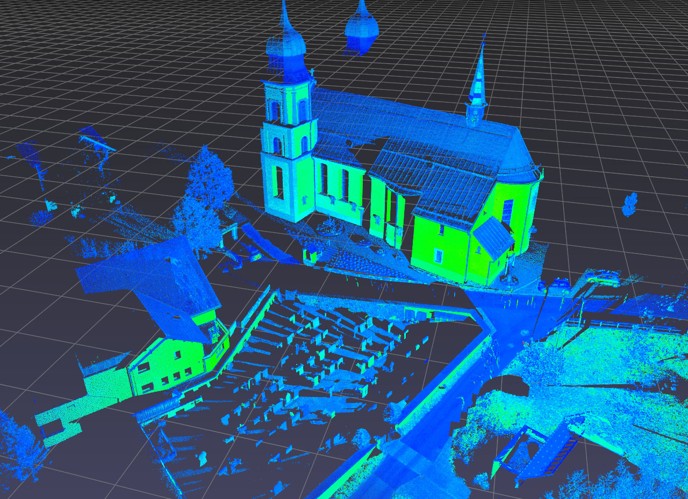
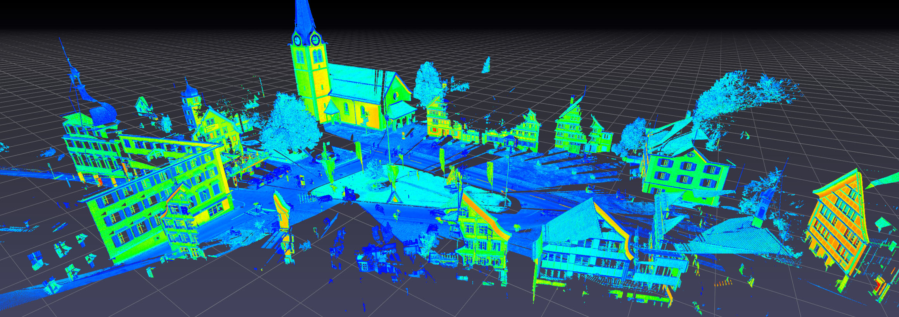

.. title:: Visualizing the Semantic3D dataset

Semantic3D
==========

.. _Semantic3D: http://semantic3d.net

Download the following zip files from the `Semantic3D`_ website.

* :file:`bildstein_station1_xyz_intensity_rgb.7z` (0.20 GB)
  [`download <http://semantic3d.net/data/point-clouds/training1/bildstein_station1_xyz_intensity_rgb.7z>`__]
* :file:`sem8_labels_training.7z` (0.01 GB)
  [`download <http://semantic3d.net/data/sem8_labels_training.7z>`__]

Extract the zip files and check that you have at least the following files.

* :file:`bildstein_station1_xyz_intensity_rgb.txt`
* :file:`bildstein_station1_xyz_intensity_rgb.labels`

Point clouds are stored in .txt files, and their per-point labels are stored in corresponding .label files.

In a Python terminal, import the following Python packages.

.. code-block:: python

    >>> import pptk
    >>> import pandas as pd
    >>> import numpy as np

Copy and paste the following function definitions for reading Semantic3D .txt and .labels files into your Python terminal.
Note these functions are merely simple wrappers around the :py:func:`pandas.read_csv` function.

.. code-block:: python

    def read_points(f):
        # reads Semantic3D .txt file f into a pandas dataframe
        col_names = ['x', 'y', 'z', 'i', 'r', 'g', 'b']
        col_dtype = {'x': np.float32, 'y': np.float32, 'z': np.float32, 'i': np.int32,
                      'r': np.uint8, 'g': np.uint8, 'b': np.uint8}
        return pd.read_csv(f, names=col_names, dtype=col_dtype, delim_whitespace=True)

.. code-block:: python

    def read_labels(f):
        # reads Semantic3D .labels file f into a pandas dataframe
        return pd.read_csv(f, header=None)[0].values

Read :file:`bildstein_station1_xyz_intensity_rgb.txt`.

.. code-block:: python

    >>> points = read_points('bildstein_station1_xyz_intensity_rgb.txt')
    >>> points
                      x          y       z     i    r    g    b
    0         20.622999  40.276001  -1.999 -1031  127  141  154
    1         20.362000  40.375000  -2.239  -941  130  141  159
    2         20.360001  40.375999  -2.402 -1083  139  151  165
    ...             ...        ...     ...   ...  ...  ...  ...
    29697590  60.196999  82.137001  11.085 -1619  134  140  172
    
    [29697591 rows x 7 columns]

Read :file:`bildstein_station1_xyz_intensity_rgb.labels`.

.. code-block:: python

    >>> labels = read_labels('bildstein_station1_xyz_intensity_rgb.labels')
    >>> labels
        array([0, 0, 6, ..., 0, 0, 0], dtype=int64)

Visualize (refer to the :doc:`viewer page <../../viewer>` for control details).

    >>> v = pptk.viewer(points[['x', 'y', 'z']])
    >>> v.attributes(points[['r', 'g', 'b']] / 255., points['i'])
    >>> v.set(point_size=0.001)

Visualize point labels, showing only points with non-zero labels (in this dataset label 0 denotes lack of a label).

    >>> mask = labels != 0
    >>> P = points[mask]
    >>> L = labels[mask]
    
    >>> v = pptk.viewer(P[['x', 'y', 'z']])
    >>> v.attributes(P[['r', 'g', 'b']] / 255., P['i'], L)
    >>> v.set(point_size=0.001)

Toggle between attributes using the :kbd:`[` and :kbd:`]` keys.

.. |semantic3d_small_labels| image:: images/semantic3d_small_labels.jpg
   :width: 300px
   :align: middle

.. rst-class:: image-grid
.. table::
   :widths: 310 310 310
   :align: center

   ====================== ==================== =========================
   |semantic3d_small_rgb| |semantic3d_small_i| |semantic3d_small_labels|
   ====================== ==================== =========================

.. rst-class:: caption

   +-------------------------------------------------------------------------------+
   | The `Semantic3D`_ :file:`bildstein1` point cloud,                             |
   | with 0-labeled points removed, visualized using :py:meth:`pptk.viewer`.       |
   | Points are colored by RGB (left), intensity (middle), semantic label (right). |
   +-------------------------------------------------------------------------------+

Basic support for point annotation
----------------------------------

**Selecting points**.
Holding :kbd:`Ctrl` while performing a :kbd:`LMB` drag creates an "additive" selection box;
when the :kbd:`LMB` is released, all points in the box are added into a set of currently selected points.
Holding :kbd:`Ctrl-Shift` while performing the :kbd:`LMB` drag creates a "subtractive" selection box;
when the mouse button is released, all points in the box are removed from the set of currently selected points.
Individual points can be added or removed from the set
by left clicking on a point while holding :kbd:`Ctrl` or :kbd:`Ctrl-Shift`.
Right click to deselect all.

.. note::
   On Mac, use :kbd:`⌘` instead of :kbd:`Ctrl`

Query the selected point indices using :py:meth:`pptk.viewer.get`.

.. code-block:: python

    >>> indices = v.get('selected')

When editting a selection containing a large number of points, consider "saving" often.
If the selection is ever lost (e.g. accidental deselection),
the selection can be restored using :py:meth:`pptk.viewer.set`.

.. code-block:: python

    >>> v.set(selected=indices)

Visualizing very large point clouds
-----------------------------------

The above procedure can be repeated for other point clouds in Semantic 3D.
However, pptk viewer may fail to start for larger inputs
(the actual input size depends on system and GPU memory;
on certain machines this is known to happen for inputs larger than roughly 100M points).
One workaround is to subsample (keep every k-th point) the input point cloud.
Though imperfect, this in many cases can still give a reasonably accurate view of the point cloud.

Here we show how to visualize the largest point cloud in `Semantic3D`_.

* :code:`sg27_station2_intensity_rgb.7z` (2.72 GB)
  [`download <http://semantic3d.net/data/point-clouds/training1/sg27_station2_intensity_rgb.7z>`__]

Read points
(this may take a few minutes as the point cloud is quite large;
on a test machine this took ~6 min to load and used ~9GB of memory).

.. code-block:: python

    >>> points = read_points('sg27_station2_intensity_rgb.txt')
    >>> points
                        x          y       z     i    r    g    b
    0          -79.001999  15.598000  10.773 -1709  152  126   99
    1         -101.685997  25.760000  15.934 -1111   32   22   21
    2         -101.842003  25.563999  15.966 -1279  131  102   84
    ...               ...        ...     ...   ...  ...  ...  ...
    496702860   42.551998  94.640999   2.531 -1479  140  108  113
    
    [496702861 rows x 7 columns]

(Optional) Consider saving points to .npy files for faster loading in the future.

.. code-block:: python

   >>> np.save('sg27_station2.xyz.npy', points[['x', 'y', 'z']].values)
   >>> np.save('sg27_station2.rgb.npy', points[['r', 'g', 'b']].values)
   >>> np.save('sg27_station2.i.npy', points['i'].values)

Read labels.

.. code-block:: python

    >>> labels = read_labels('sg27_station2_intensity_rgb.labels')
    >>> labels
        array([2, 2, 2, ..., 6, 6, 6], dtype=int64)

Subsample points and labels by keeping only every 6-th point.
This leaves 82,783,811 points (just under 100M points).

.. code-block:: python

    >>> P = points[:: 6]
    >>> L = labels[:: 6]

Remove 0-labeled points.

.. code-block:: python

    >>> mask = L != 0
    >>> P = P[mask]
    >>> L = L[mask]

Visualize.

.. code-block:: python

    >>> v = pptk.viewer(P[['x', 'y', 'z']])
    >>> v.attributes(P[['r', 'g', 'b']] / 255., P['i'], L)
    >>> v.set(point_size=0.001)

.. image:: images/semantic3d_large_rgb.jpg
   :width: 90%
   :align: center

.. image:: images/semantic3d_large_labels.jpg
   :width: 90%
   :align: center

.. rst-class:: caption

   +----------------------------------------------------------------------------------------------+
   | The `Semantic3D`_ :file:`sg27_station2` point cloud visualized using :py:meth:`pptk.viewer`. |
   | Point cloud has been subsampled by a factor of 6 and removed of 0-labeled points.            |
   | Points are colored by RGB (top), intensity (middle), semantic label (bottom).                |
   +----------------------------------------------------------------------------------------------+

